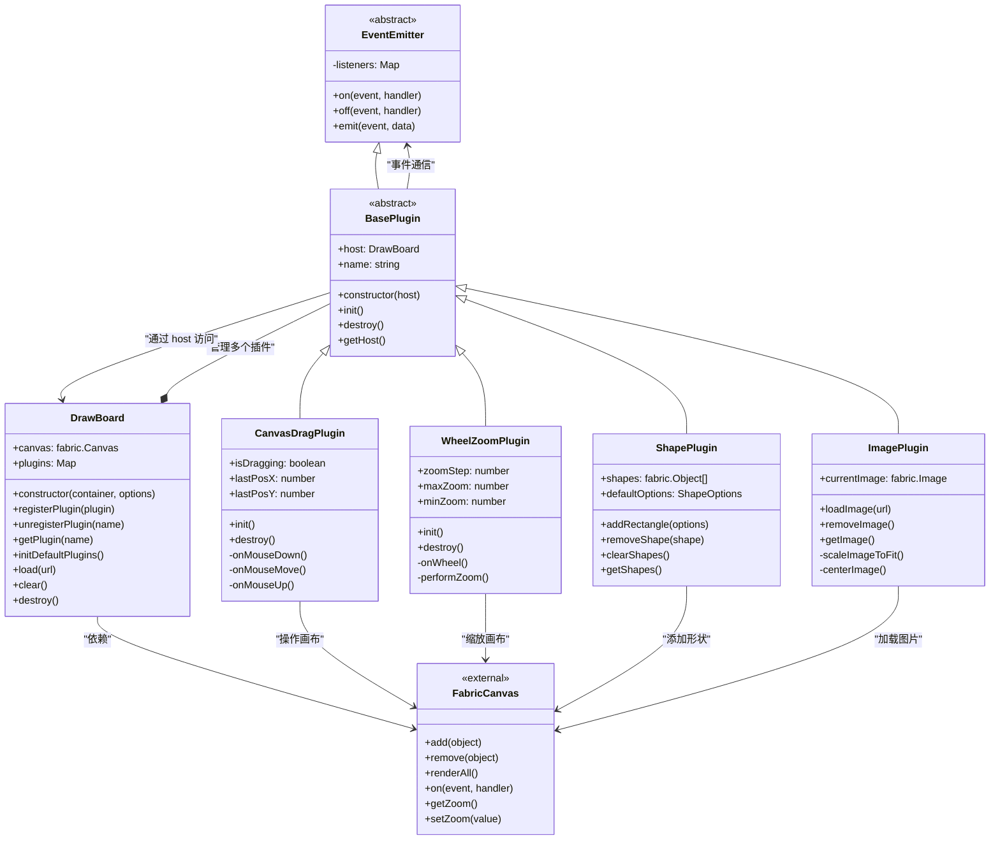
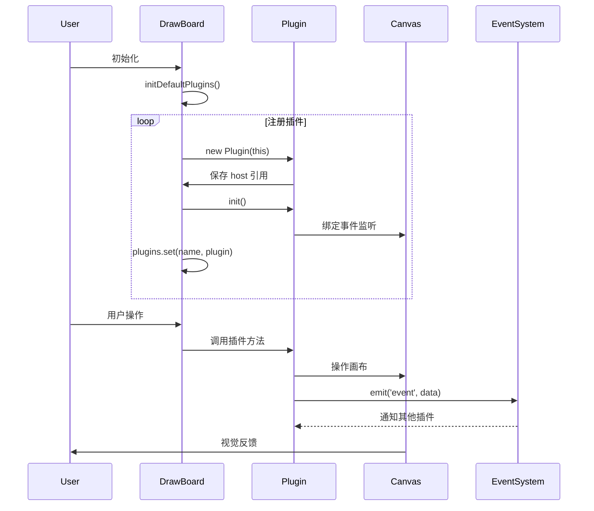

# DrawBoard 插件架构图

## 架构概览

本文档展示了 DrawBoard 的插件化架构设计，重点体现了插件设计模式的核心理念和实现方式。

## 架构图



## 插件交互流程图



## 核心设计模式

### 1. 插件模式 (Plugin Pattern)

**实现方式：**

* `BasePlugin` 抽象基类定义插件接口

* `DrawBoard` 作为插件宿主，管理插件生命周期

* 插件通过 `host` 引用访问宿主功能

**优势：**

* 功能模块化，易于扩展

* 插件可独立开发和测试

* 支持动态加载和卸载

### 2. 观察者模式 (Observer Pattern)

**实现方式：**

* `EventEmitter` 提供事件发布订阅机制

* 插件间通过事件进行松耦合通信

* 支持一对多的事件通知

**优势：**

* 降低组件间耦合度

* 支持动态的事件订阅

* 易于扩展新的事件类型

### 3. 策略模式 (Strategy Pattern)

**实现方式：**

* 不同插件实现不同的交互策略

* 可根据需求选择性加载插件

* 插件可配置不同的行为参数

**优势：**

* 算法可互换

* 易于添加新策略

* 运行时可切换策略

## 架构优势

### 1. 模块化设计

* **单一职责**：每个插件专注于特定功能

* **高内聚**：相关功能集中在同一插件内

* **低耦合**：插件间通过事件系统通信

### 2. 可扩展性

* **水平扩展**：可轻松添加新插件

* **垂直扩展**：可增强现有插件功能

* **配置灵活**：支持插件参数配置

### 3. 可维护性

* **代码隔离**：插件故障不影响其他模块

* **独立测试**：每个插件可单独测试

* **版本管理**：插件可独立版本控制

### 4. 团队协作

* **并行开发**：不同团队可同时开发不同插件

* **技能分工**：专业团队负责专业插件

* **代码复用**：插件可在不同项目间复用

## 插件详细说明

### CanvasDragPlugin - 画布拖拽插件

* **功能**：实现鼠标右键拖拽画布

* **事件**：监听 mouse:down、mouse:move、mouse:up

* **状态**：维护拖拽状态和位置信息

### WheelZoomPlugin - 滚轮缩放插件

* **功能**：实现鼠标滚轮缩放画布

* **配置**：支持缩放步长、最大/最小缩放比例

* **优化**：以鼠标位置为中心进行缩放

### ShapePlugin - 形状管理插件

* **功能**：添加、删除、管理几何形状

* **类型**：支持矩形、圆形等基础形状

* **样式**：可配置填充色、边框等属性

### ImagePlugin - 图片处理插件

* **功能**：加载、缩放、定位图片

* **特性**：自动适应画布尺寸、居中显示

* **管理**：支持图片替换和移除

## 扩展指南

### 创建新插件

1. **继承 BasePlugin**

```typescript
class CustomPlugin extends BasePlugin {
  constructor(host: DrawBoard, options?: CustomOptions) {
    super(host);
    this.name = 'CustomPlugin';
  }
}
```

1. **实现生命周期方法**

```typescript
init() {
  // 初始化逻辑
  this.canvas.on('event', this.handleEvent.bind(this));
}

destroy() {
  // 清理逻辑
  this.canvas.off('event', this.handleEvent);
}
```

1. **注册插件**

```typescript
const customPlugin = new CustomPlugin(drawBoard, options);
drawBoard.registerPlugin(customPlugin);
```

### 插件通信

```typescript
// 发送事件
this.emit('custom:event', { data: 'value' });

// 监听事件
this.on('other:event', (data) => {
  // 处理事件
});
```

## 总结

DrawBoard 的插件架构通过合理的设计模式组合，实现了高度模块化、可扩展的绘图系统。这种架构不仅提高了代码的可维护性和可测试性，还为团队协作和功能扩展提供了良好的基础。通过插件模式，系统可以根据实际需求灵活组合功能，实现了真正的按需加载和定制化开发。
