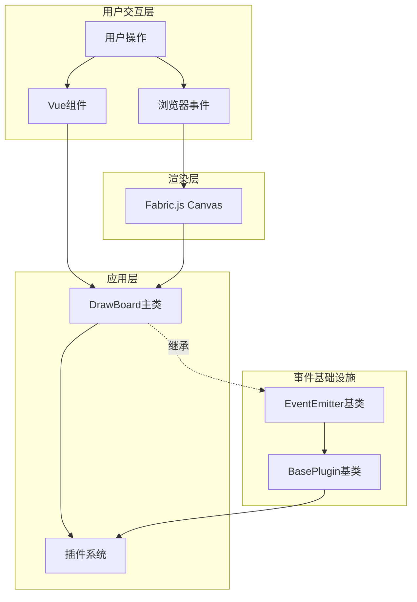
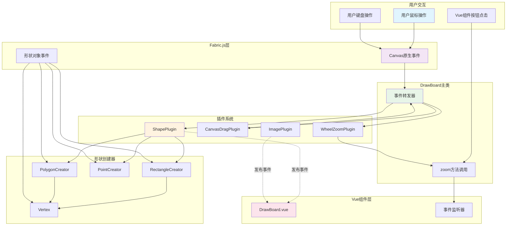

# 事件系统流向图

## 1. 事件系统架构概览

本项目采用了分层的事件驱动架构，主要包含以下几个层次：



## 2. 核心事件系统组件

### 2.1 EventEmitter 基础类

**位置**: `/src/modules/EventEmitter.ts`

**功能**: 提供基础的事件发布订阅能力

**核心方法**:

- `on(event, listener)`: 订阅事件

- `once(event, listener)`: 一次性订阅事件

- `un(event, listener)`: 取消订阅

- `emit(event, ...args)`: 发布事件

- `unAll()`: 清空所有事件监听器

### 2.2 BasePlugin 基类

**位置**: `/src/modules/BasePlugin.ts`

**功能**: 所有插件的基类，继承自 EventEmitter

**事件类型**:

```typescript
export type BasePluginEvents = {
  destroy: []
}
```

## 3. 主要事件发布者

### 3.1 DrawBoard 主类

**位置**: `/src/modules/DrawBoard/index.ts`

**事件类型**:

```typescript
export type DrawBoradEvents = {
  load: []
  zoom: [number]
  mouseDown: [e: TPointerEventInfo]
  mouseUp: [e: TPointerEventInfo]
  mouseOver: [e: TPointerEventInfo]
  mouseOut: [e: TPointerEventInfo]
  mouseMove: [e: TPointerEventInfo]
  mouseWheel: [e: TPointerEventInfo]
}
```

**事件发布时机**:

- `zoom`: 画布缩放时触发

- `mouseDown/Up/Over/Out/Move/Wheel`: 鼠标交互时触发

### 3.2 ShapePlugin 插件

**位置**: `/src/modules/DrawBoard/plugins/ShapePlugin.ts`

**事件类型**:

```typescript
export type ShapePluginEvents = BasePluginEvents & {
  shapeAdded: [shape: FabricObject]
  shapeRemoved: [shape: FabricObject]
}
```

**事件发布时机**:

- `shapeAdded`: 添加形状时触发

- `shapeRemoved`: 移除形状时触发

### 3.3 ImagePlugin 插件

**位置**: `/src/modules/DrawBoard/plugins/ImagePlugin.ts`

**事件发布时机**:

- `imageLoaded`: 图片加载成功时触发

- `imageLoadError`: 图片加载失败时触发

## 4. 主要事件订阅者

### 4.1 WheelZoomPlugin

**订阅事件**: `DrawBoard.mouseWheel`

**处理逻辑**: 处理滚轮缩放操作

```typescript
// 订阅
this.host?.on('mouseWheel', this.handleMouseWheel)

// 取消订阅
this.host?.un('mouseWheel', this.handleMouseWheel)
```

### 4.2 CanvasDragPlugin

**订阅事件**:

- `DrawBoard.mouseMove`

- `DrawBoard.mouseDown`

- `DrawBoard.mouseUp`

**处理逻辑**: 处理画布拖拽操作

```typescript
// 订阅多个事件
this.host.on('mouseMove', this.handleMouseMove)
this.host.on('mouseDown', this.handleMouseDown)
this.host.on('mouseUp', this.handleMouseUp)
```

### 4.3 Vue 组件层

**位置**: `/example/views/DrawBoard.vue`

**订阅事件**: `DrawBoard.zoom`

```typescript
// 监听缩放事件
drawBoard.on('zoom', (data) => {
  console.log('缩放事件:', data)
})
```

## 5. Fabric.js 事件系统集成

### 5.1 Canvas 事件映射

DrawBoard 将 Fabric.js 的原生事件映射为自定义事件：

```typescript
const eventMap = {
  'mouse:down': 'mouseDown',
  'mouse:up': 'mouseUp',
  'mouse:over': 'mouseOver',
  'mouse:out': 'mouseOut',
  'mouse:move': 'mouseMove',
  'mouse:wheel': 'mouseWheel',
} as const
```

### 5.2 形状对象事件

各种形状对象直接使用 Fabric.js 的事件系统：

**矩形事件**:

- `moving`: 移动时触发

- `selected`: 选中时触发

- `deselected`: 取消选中时触发

**多边形事件**:

- `moving`: 移动时触发

- `selected`: 选中时触发

- `deselected`: 取消选中时触发

- `modified`: 修改时触发

**顶点事件**:

- `moving`: 拖拽时触发

- `mouseover`: 鼠标悬停时触发

- `mouseout`: 鼠标离开时触发

**点对象事件**:

- `moving`: 移动时触发

- `mousedown`: 鼠标按下时触发

- `mouseover`: 鼠标悬停时触发

- `selected`: 选中时触发

## 6. 完整事件流向图



## 7. 事件传播路径详解

### 7.1 鼠标交互事件流

1. **用户操作** → **浏览器事件** → **Fabric.js Canvas**
2. **Fabric.js Canvas** → **DrawBoard事件转发** → **插件响应**
3. **插件处理** → **画布状态更新** → **视觉反馈**

### 7.2 形状操作事件流

1. **用户点击按钮** → **Vue组件方法调用** → **DrawBoard API**
2. **DrawBoard API** → **ShapePlugin** → **具体创建器**
3. **创建器** → **Fabric.js对象创建** → **事件绑定**
4. **ShapePlugin** → **发布shapeAdded事件** → **Vue组件响应**

### 7.3 缩放事件流

1. **用户滚轮操作** → **Fabric.js mouseWheel事件**
2. **DrawBoard转发** → **WheelZoomPlugin处理**
3. **WheelZoomPlugin** → **调用DrawBoard.zoom()**
4. **DrawBoard.zoom()** → **发布zoom事件** → **顶点缩放补偿**
5. **Vue组件** → **监听zoom事件** → **UI状态更新**

## 8. 事件系统特点

### 8.1 优势

1. **解耦合**: 各组件通过事件通信，降低直接依赖
2. **可扩展**: 新插件可以轻松订阅现有事件
3. **统一接口**: 所有组件都使用相同的事件API
4. **类型安全**: TypeScript提供完整的事件类型定义

### 8.2 注意事项

1. **内存管理**: 需要正确取消事件订阅，避免内存泄漏
2. **事件顺序**: 某些操作需要考虑事件触发的先后顺序
3. **错误处理**: 事件处理器中的错误需要妥善处理
4. **性能考虑**: 高频事件（如mousemove）需要考虑性能优化

## 9. 最佳实践

### 9.1 事件订阅

```typescript
// 在组件初始化时订阅
protected onInit(): void {
  const unsubscribe = this.host?.on('eventName', this.handleEvent)
  this.subscriptions.push(unsubscribe)
}

// 在组件销毁时取消订阅
public destroy(): void {
  this.subscriptions.forEach(unsubscribe => unsubscribe())
  super.destroy()
}
```

### 9.2 事件发布

```typescript
// 在适当的时机发布事件
public someMethod(): void {
  // 执行操作
  const result = this.doSomething()

  // 发布事件
  this.emit('operationComplete', result)
}
```

### 9.3 类型安全

```typescript
// 定义明确的事件类型
export type MyEvents = {
  eventName: [param1: string, param2: number]
  anotherEvent: []
}

// 使用泛型确保类型安全
class MyClass extends EventEmitter<MyEvents> {
  // 实现细节
}
```
